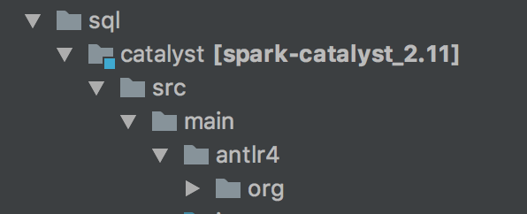
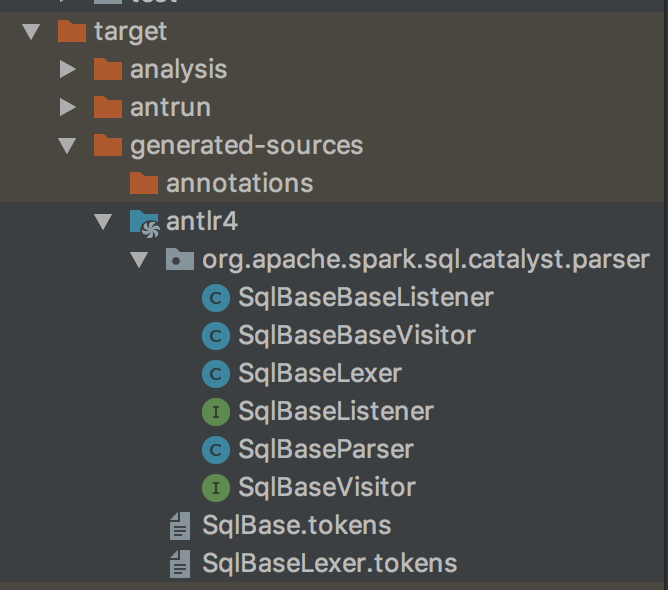
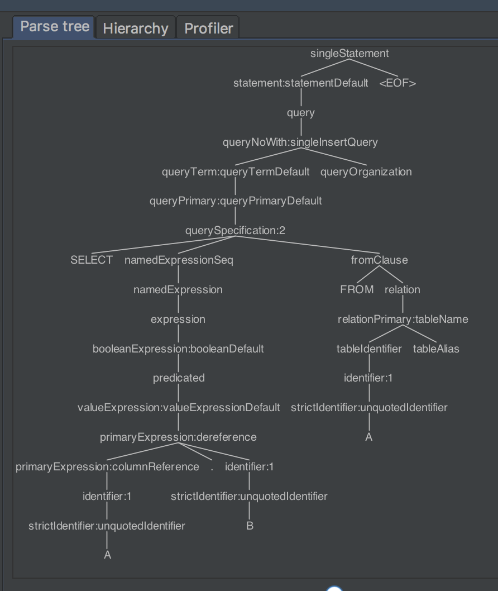

spark sql 2.3 源码解读 - antlr4 && SparkSqlParser (2.2)

​    接着上一节，我们看一下antlr4。

​    antlr可以根据输入自动生成语法树并可视化的显示出来的开源语法分析器。ANTLR—Another Tool for Language Recognition，其前身是PCCTS，它为包括Java，C++，C#在内的语言提供了一个通过语法描述来自动构造自定义语言的识别器（recognizer），编译器（parser）和解释器（translator）的框架。

​    参考此文：https://www.cnblogs.com/sld666666/p/6145854.html，我们用antlr4来实现一个四则运算器：

```
grammar Calc;

prog : stat+;

stat : expr             # printExpr
     | ID '=' expr      # assign
     | 'print(' ID ')'  # print
     ;

expr : <assoc=right> expr '^' expr # power
     | expr op=(MUL|DIV) expr   # MulDiv
     | expr op=(ADD|SUB) expr   # AddSub
     | sign=(ADD|SUB)?NUMBER       # number
     | ID                       # id
     | '(' expr ')'             # parens
     ;


ID   : [a-zA-Z]+;
NUMBER  : [0-9]+('.'([0-9]+)?)?
        | [0-9]+;
COMMENT : '/*' .*? '*/' -> skip;
LINE_COMMENT : '//' .*? '\r'? '\n' -> skip;
WS   : [ \t\r\n]+ -> skip;
MUL  : '*';
DIV  : '/';
ADD  : '+';
SUB  : '-';
```

​       在这里不再展开讲了，大家对着这个实现一遍，便能对antlr4有一个清晰的了解了。antlr4会生成如下文件：

1. ExprParser
2. ExprLexer
3. ExprBaseVistor
4. ExprVisitor

​      ExprLexer 是词法分析器， ExprParser是语法分析器。 一个语言的解析过程一般过程是 词法分析-->语法分析。这是ANTLR4为我们生成的框架代码， 而我们唯一要做的是自己实现一个Vistor，一般从ExprBaseVistor继承即可。

​     上一节提到的SqlBaseLexer便是antlr4生成的词法分析器；SparkSqlAstBuilder是继承了SqlBaseBaseVisitor的实现，用于解析逻辑的实现。

​      spark sql 中 相关源码的位置：

​      SqlBase.g4文件:

​      

​      生成的java文件(编译之后才会出现)：

​      

​      在这里推荐使用 idea的antlr插件(参考：https://blog.csdn.net/haifeng_gu/article/details/74231349)，可视化sql语句生成的语法树，有助于我们的理解。如：

​       SELECT A.B FROM A

​       

​        那么SparkSqlAstBuilder具体的代码实现以及生成的LogicalPlan具体是什么样的数据结构呢，下一节将继续介绍。